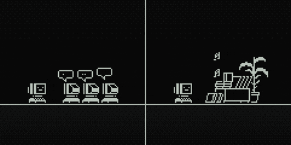

#

Estudante de Desenvolvimento de Software na Faculdade de Tecnologia de Jahu. Atualmente atuo como DevOps, cuidando da estabilidade e da infraestrutura de diversas aplicações. No momento, tenho me dedicado aos estudos de Linux, redes e fundamentos de sistemas. Gosto de aprender novas tecnologias e aplicá-las na criação de soluções eficientes e inovadoras.

#

  <h3>Connect with me:</h3>
  
  
  

<h3 align="left">Languages & Frameworks</h3>
  

  
  
  
  
  

<h3 align="left">Databases</h3>

  
  

<h3 align="left">Tools & Platforms</h3>
  

  
  
  

<h3 align="left">Cloud & Infra</h3>
  

  
  
  
    
  

<h3 align="left">Currently Studying</h3>

- Linux Internals & System Fundamentals
- Computer Networking & Protocols
- Cloud & Security Fundamentals

<picture>
  <source media="(prefers-color-scheme: dark)" srcset="https://raw.githubusercontent.com/ViniciusCassemira/ViniciusCassemira/output/github-contribution-grid-snake-dark.svg">
  <source media="(prefers-color-scheme: light)" srcset="https://raw.githubusercontent.com/ViniciusCassemira/ViniciusCassemira/output/github-contribution-grid-snake.svg">
  
</picture>
  

